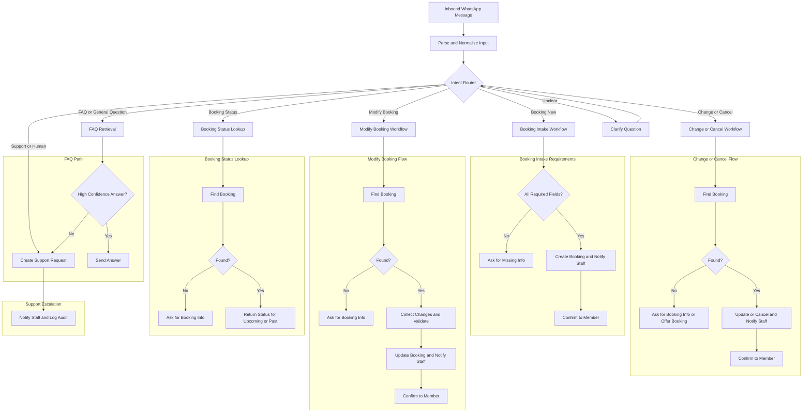

# Tee Time Booking WhatsApp Bots

An automated WhatsApp-based tee-time booking system featuring member onboarding, FAQ automation, and a dedicated staff administration dashboard.

## Project Structure

- `apps/admin`: Vite + React admin UI.
- `apps/api`: Hono + TypeScript API (admin endpoints + health + auth).
- `apps/worker`: Scheduled job runner, data retention cleanup, and report generation.
- `packages/agent`: AI SDK agent setup (OpenRouter provider).
- `packages/core`: Business logic and services.
- `packages/database`: Drizzle schema, migrations, and repositories.
- `packages/evals`: Agent eval runner (booking, FAQ, fallback, updates).

## Commands

- `bun install`: install workspace dependencies.
- `bun --filter @tee-time/admin dev`: run the admin app.
- `bun --filter @tee-time/api dev`: run the API server.
- `bun --filter @tee-time/worker dev`: run the worker service.
- `bun db:generate`: generate Drizzle migrations.
- `bun db:migrate`: apply migrations.
- `bun run lint`: run Biome lint.
- `bun run format`: run Biome format.
- `bun run check`: run Biome check.
- `bun run chat`: run the local CLI chat harness.
- `bun run evals`: run agent evals (use `--help` for options).

## Agent Routing Overview



## API Highlights

- **Auth**: Better Auth endpoints mounted under `/api/auth/*`.
- **Health**: `/health` and `/ready` (DB connectivity).
- **Admin**: CRUD endpoints for staff, members, bookings, clubs/locations, support requests, audit logs, message logs, and FAQs.
- **Reports**: `/api/reports/*` for booking and member analytics.
- **WhatsApp Webhook**: `/webhooks/whatsapp` for inbound message handling.
- **Current User**: `/api/me` (get/update profile).

## Admin Dashboard

The admin UI lives in `apps/admin` and is built with Vite + React. It provides:
- Staff and member management screens.
- Booking overview and manual adjustments.
- FAQ management with vector‑based search.
- Reports dashboard (conversion, response time, booking mix).
- Real‑time Slack notifications for new bookings and support requests.

## Development Workflow

1. Install dependencies: `bun install`
2. Create a `.env` (copy from `.env.example`) and fill in required secrets.
3. Run the admin UI: `bun --filter @tee-time/admin dev`
4. Run the API server: `bun --filter @tee-time/api dev`
5. Run database migrations when schema changes:
   - Generate: `bun db:generate`
   - Apply: `bun db:migrate`
6. Lint / format: `bun run lint` / `bun run format`
7. Run type‑checking: `bun run check`

## Testing

Use the eval harness for system checks:
```
bun run evals --help
```

Unit and integration tests live alongside each package under `__tests__`. Run them with:
```
bun test
```

## License

MIT
