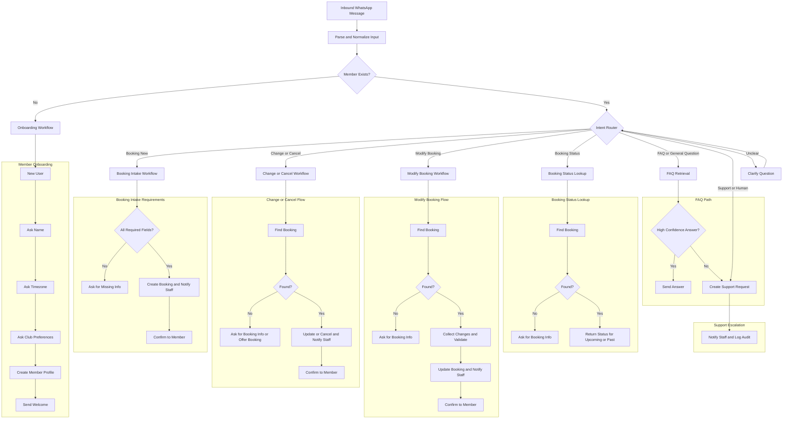

# WhatsApp Bot for Tee Time Booking

An AI-powered automated WhatsApp booking system designed to streamline golf tee time reservations, featuring intelligent member onboarding, FAQ automation, and a comprehensive staff administration dashboard.

## Project Structure

- `apps/admin`: Vite + React admin UI.
- `apps/api`: Hono + TypeScript API (admin endpoints + health + auth).
- `apps/worker`: Scheduled job runner, data retention cleanup, and report generation.
- `packages/agent`: AI SDK agent setup (OpenRouter provider).
- `packages/core`: Business logic and services.
- `packages/database`: Drizzle schema, migrations, and repositories.
- `packages/evals`: Agent eval runner (booking, FAQ, fallback, updates).

## Technology Stack

- **Runtime**: [`Bun`](https://bun.sh)
- **Language**: [`TypeScript`](https://www.typescriptlang.org)
- **Frameworks**: [`Hono`](https://hono.dev), [`React`](https://react.dev), [`Vite`](https://vite.dev)
- **Database**: [`PostgreSQL`](https://www.postgresql.org) with [`PostGIS`](https://postgis.net), managed via [`drizzle-orm`](https://orm.drizzle.team/)
- **AI**: [`Vercel AI SDK`](https://ai-sdk.dev/docs/introduction) + [`OpenRouter`](https://openrouter.ai)
- **UI**: [`Tailwind CSS`](https://tailwindcss.com), [`shadcn/ui`](https://ui.shadcn.com), [`TanStack Query`](https://tanstack.com/query/latest)
- **Messaging**: [`Twilio`](https://www.twilio.com) (WhatsApp), [`Slack`](https://slack.com) (Admin Notifications)
- **Tooling**: [`Biome`](https://biomejs.dev) (Linting/Formatting), [`dotenvx`](https://github.com/dotenvx/dotenvx)

## Commands

Common development commands mapping to `package.json` scripts:

- `bun install`: Install workspace dependencies.
- `bun run admin:dev`: Run the admin UI (localhost:5173).
- `bun run api:dev`: Run the API server (localhost:8787).
- `bun run worker:dev`: Run the background worker.
- `bun run db:generate`: Generate Drizzle migrations.
- `bun run db:migrate`: Apply database migrations.
- `bun run lint`: Run Biome lint.
- `bun run format`: Run Biome format.
- `bun run chat`: Run the local CLI chat harness for testing agent flows.
- `bun run evals`: Run agent evaluation suite.


## Agent Routing Overview



## Example Booking Flow

```text
You: I would like to book some tee time
Agent: What name should we use for your member profile?

You: George Michael
Agent: What timezone are you in? (e.g., Europe/London) You can say "skip".

You: Dallas, TX
Agent: Do you have a favorite club? You can say "skip".

You: TopGolf
Agent: Do you have a preferred club location? You can say "skip".

You: skip
Agent: Do you have a preferred bay? You can say "skip".

You: no
Agent: Welcome, George Michael! You're all set up. How can I help you book some tee time?

You: i would like book a 2hr slot tommorow at 5pm
Agent: Which location should we use for that club?
Available locations:
- Dallas
- Austin
- The Colony

You: Dallas
Agent: What are the names of the other guests?

You: Sarah, Devin
Agent: Which bay should we use?
Available bays:
- Bay 3
- Bay 4
- Bay 5
- Bay 1
- Bay 2

You: 5
Agent: Please confirm these booking details:

⛳ Club: Topgolf (Dallas)
🎯 Bay: Bay 5
📅 Date: 2025-12-30
🕒 Time: 17:00
👥 Players: 3
👤 Guests: Sarah, Devin

You: looks good to me

<send slack message to staff>

Agent: I can help book a new tee time, update or cancel your existing booking, check booking status, and answer FAQs. If you need something else, I can connect you to staff. 
```

## Admin Dashboard

The admin UI (`apps/admin`) lives at `http://localhost:5173` during development and offers:

- **Overview**: Real-time stats, recent activity feed, and quick actions.
- **Bookings**: Detailed list view, filtered search, and manual booking management.
- **Members**: Complete member directory, profile management, and onboarding status.
- **Clubs**: Configuration for golf clubs and their specific locations/bays.
- **Messages**: Support request management and full conversation history view.
- **Reports**: Analytics for bookings, member growth, and system usage.
- **Audit Logs**: Secuirty and operational logs for all staff actions.
- **Settings**: System configuration including Staff management and KB/FAQ updates.

## Development Workflow

1.  **Setup**:
    ```bash
    bun install
    cp .env.example .env
    # Fill in required secrets in .env
    ```

2.  **Database**:
    ```bash
    bun run db:generate
    bun run db:migrate
    ```

3.  **Run Services**:
    Open separate terminals for:
    - API: `bun run api:dev`
    - Admin: `bun run admin:dev`
    - Worker: `bun run worker:dev` (optional, for scheduled tasks)

4.  **Testing**:
    - Unit tests: `bun test`
    - Agent Evals: `bun run evals`
    - Interactive Chat: `bun run chat`

## Agent Evaluation Suite

The `packages/evals` module provides a comprehensive agent evaluation framework for validating the WhatsApp booking agent's behavior across various conversation flows.

### Test Suites

| Suite | Description | Default Count |
|-------|-------------|---------------|
| `booking` | New booking request flows | 15 |
| `booking-status` | Booking status & lookup flows | 8 |
| `cancel` | Cancel booking flows | 8 |
| `modify` | Modify booking flows | 6 |
| `onboarding` | New user onboarding | 5 |
| `multi-turn` | Multi-turn conversations | 10 |
| `faq` | FAQ question flows | 10 |
| `fallback` | Fallback/support/clarify flows | 8 |
| `edge-cases` | Edge cases & failure scenarios | 15 |
| `updates` | Status update message tests | 6 |
| `state-persistence` | State continuity & context retention | 2 |
| `multi-booking` | Multi-booking selections & disambiguation | 2 |
| `course-correction` | Mid-flow corrections & resets | 2 |

### Running Evals

```bash
# Run all suites with defaults
bun run evals

# Run specific suites
bun run evals --suite booking,cancel

# Run with custom scenario counts
bun run evals --edge-cases 20 --booking 10

# Output summary only (suppress per-test logs)
bun run evals --summary-only

# Output JSON report
bun run evals --json
```

### CLI Options

| Option | Description |
|--------|-------------|
| `--suite <list>` | Run specific suites (comma-separated) |
| `--<suite-name> <n>` | Set scenario count for a suite (e.g., `--booking 20`) |
| `--seed <n>` | Shuffle seed for reproducibility (default: current timestamp) |
| `--allow-faq-escalation` | Treat FAQ escalations as pass |
| `--summary-only` | Print only the final summary table |
| `--parallel` | Run suites concurrently (faster execution) |
| `--notify` | Allow Slack notifications during evals |
| `--json` | Output JSON report |
| `--transcripts [path]` | Save conversation transcripts to file |
| `--verbose` | Verbose output (sets log level higher) |

### Transcript Capture

Capture full conversation transcripts for debugging or review:

```bash
# Save transcripts to a custom path
bun run evals --transcripts review.txt

# Auto-generated path based on timestamp
bun run evals --transcripts
```

Transcript output includes:
- Scenario ID and status (`PASS`/`FAIL`/`SKIP`)
- Full USER ↔ AGENT conversation turns
- Failure details when applicable

### Report Output

The eval runner produces a summary report showing:
- Per-suite pass/fail/skip counts
- Total duration
- Detailed failure list with reasons
- Scenario results table with status indicators

Example output:
```text
🏌️ Tee Time Agent Evals
========================
Suites: booking, cancel, faq
Seed: 1704825600000

========================================
EVALS REPORT
========================================
Duration: 45.2s
Total: 28/33 passed

[PASS] booking: 13/15 passed (2 failed, 0 skipped)
[PASS] cancel: 7/8 passed (1 failed, 0 skipped)
[PASS] faq: 8/10 passed (0 failed, 2 skipped)

❌ Failures:
  - booking/booking-12 - Expected flow booking-new, got clarify
  - cancel/cancel-5 - Missing prompt text: confirm

========================================
Result: FAILED (3 failures)
========================================
```

## License

MIT
